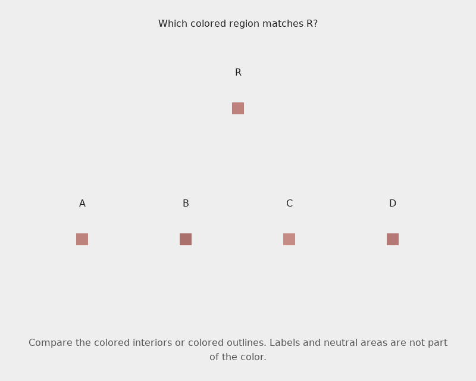
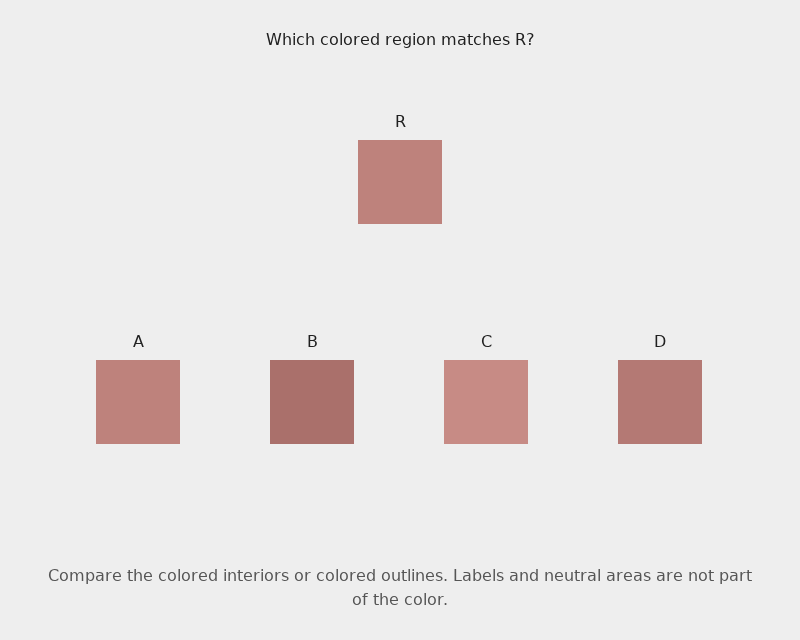
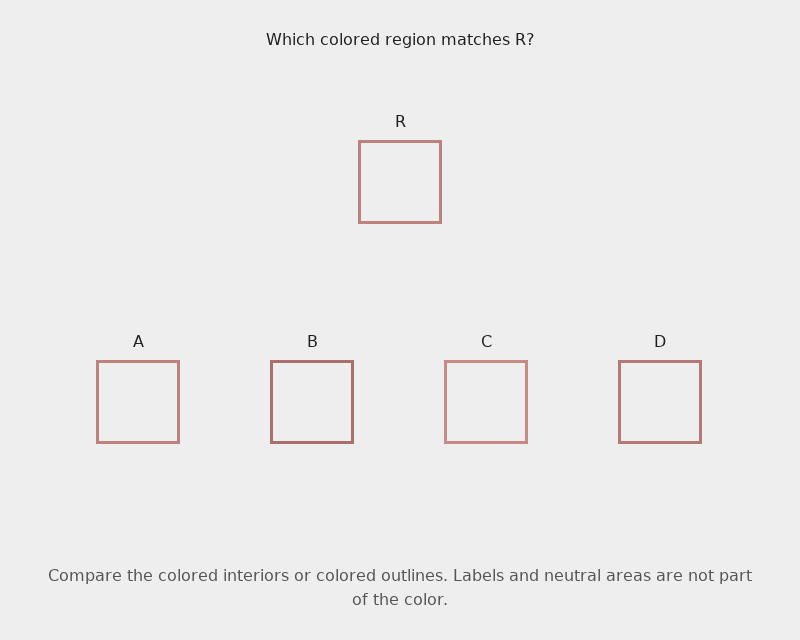
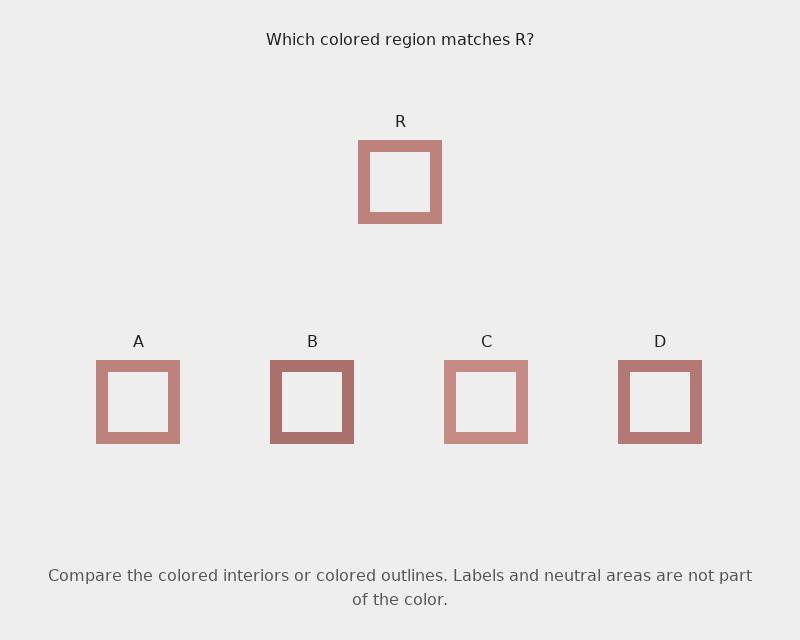

# ColorBench 0.4.0: results from the repaired direct-color pilot

Measured on **September 16, 2026**. Thirteen model configurations completed the
same **512 questions over 456 images**, producing **6,656 final responses**.
Four invalid responses remain in the results. The
[sealed run](runs/0.4.0/pilot-20260916),
[publication data](colorbench-pilot-0.4.0.json),
[paired analysis](colorbench-pilot-0.4.0-analysis.json), and
[independent audit](colorbench-pilot-0.4.0-audit.json) preserve the evidence.

The paired controls make two patterns visible. Larger filled squares helped
many models match colors, while thicker outlines produced a smaller, less
consistent benefit. Colored surrounds reduced pooled matching accuracy, but
some models handled them well. Same–different answers were often consistent
across prompt mappings while repeatedly missing real color differences.

GPT-6 Astra answered every choice question correctly in all nine families.
Its numerical estimates remained approximate: none of its sixteen RGB answers
matched every channel exactly, although all were within ΔE_OK 0.02. Claude
Fable 5.1 had the smallest mean RGB reconstruction error. Matching a visible
reference and reconstructing its coordinates remain distinct tasks.

## What was repaired

Release 0.4.0 keeps ColorBench's direct-color scope. It clarifies that colored
outlines count, replaces gradient endpoint shortcuts with shared endpoints
and histograms, and balances same–different inputs so either patch alone is
uninformative. Ordering tasks reuse intermediate colors with lower and higher
partners. Context and geometry now have matched controls with identical
colors, references, labels, and wording.

The [methodology](../docs/methodology.md) and
[repair notes](../docs/direct-color-repairs-0.4.0.md) give the construction.
Independent decoded-image checks confirm the intended constraints. In ordering
tasks, a single-patch lookup still has a 62.5% ceiling; the repair removes
perfect prediction without claiming to eliminate every absolute-color cue.
Gradient controls are finite permutations, including two fields matched under
Pillow's 8-bit `L` conversion. No model grayscale or masked-input ablation was
performed, and those checks do not identify a model's strategy.

All measurements below are fresh requests. The
[0.3.2 results](third-pilot.md) remain unchanged historical observations; score
differences across releases must not be read as model improvement.

## Results by task

Counts below pool the thirteen models within each family. They describe this
fixed cohort, whose related questions are correlated. Choice accuracy includes
invalid responses as incorrect. Chance accuracy is 50% for lightness, chroma,
and same–different, and 25% for the other choice families.

| Family | Questions per model | Correct / responses | Accuracy |
| --- | ---: | ---: | ---: |
| Exact swatch matching | 48 | 470 / 624 | 75.3% |
| Component fill matching | 48 | 459 / 624 | 73.6% |
| Lightness | 64 | 750 / 832 | 90.1% |
| Chroma | 64 | 794 / 832 | 95.4% |
| Hue, both contexts | 32 | 364 / 416 | 87.5% |
| Gradient matching | 16 | 206 / 208 | 99.0% |
| Same–different | 48 | 419 / 624 | 67.1% |
| Context, all surrounds | 80 | 735 / 1,040 | 70.7% |
| Small-region, all geometries | 64 | 466 / 832 | 56.0% |

There is no combined benchmark score. Small-region accuracy especially needs
its separate geometry results, and hue needs its fixed/varying breakdown.

The following table gives correct counts for every model on the matching,
ordering, and hue tasks. Hue's fixed condition permits exact color matching;
the varying condition changes lightness and chroma while preserving the target
hue relation.

| Model | Matching /48 | Component fill /48 | Lightness /64 | Chroma /64 | Hue fixed /16 | Hue varying /16 |
| --- | ---: | ---: | ---: | ---: | ---: | ---: |
| Claude Fable 5.1 | 42 | 41 | 62 | 63 | 16 | 16 |
| Claude Haiku 4.5 | 23 | 20 | 42 | 53 | 10 | 8 |
| Claude Opus 5 | 37 | 37 | 61 | 64 | 15 | 14 |
| Claude Sonnet 5 | 36 | 33 | 57 | 59 | 14 | 12 |
| Gemini 3.1 Pro Preview | 37 | 36 | 62 | 64 | 15 | 15 |
| Gemini 3.5 Flash-Lite | 23 | 23 | 53 | 60 | 12 | 12 |
| Gemini 3.8 Flash | 33 | 34 | 63 | 62 | 15 | 14 |
| GPT-5.6 Luna | 41 | 39 | 64 | 64 | 15 | 15 |
| GPT-5.6 Sol | 42 | 42 | 59 | 64 | 16 | 16 |
| GPT-5.6 Terra | 40 | 37 | 61 | 64 | 15 | 16 |
| GPT-6 Astra | 48 | 48 | 64 | 64 | 16 | 16 |
| Muse Spark 1.2 | 35 | 35 | 50 | 56 | 14 | 12 |
| Muse Spark 1.3 | 33 | 34 | 52 | 57 | 13 | 12 |

Astra and Luna both answered all 64 lightness and all 64 chroma questions
correctly. Opus, Gemini Pro, Sol, and Terra also completed chroma without an
error. Fable, Sol, Terra, and Astra each answered all sixteen varying-context
hue questions correctly. Across all models, fixed-context hue was **186/208
(89.4%)** and varying-context hue was **178/208 (85.6%)**. These are two small
construction slices, not a controlled estimate of a universal hue penalty.

The redesigned gradients were nearly saturated: twelve models scored **16/16**,
and Haiku scored **14/16**. Passing the endpoint and histogram controls therefore
did not make this small family broadly difficult. It supports success on these
fields, not general recovery of arbitrary color progressions.

The component-fill condition scored **459/624**, versus **470/624** for plain
swatch matching. The paired counts were 414 correct in both, 56 correct only
for plain swatches, 45 correct only for component fills, and 109 incorrect in
both. Neutral frames and the accompanying question wording both change, so
this comparison does not isolate a frame effect. The net difference was modest,
and the individual answers changed in both directions.

## Matched surrounds, size, and stroke width

Each row below contains **208 pairs: sixteen per model**. “Before only” means
the first condition was correct and the second was wrong; “after only” means
the reverse. Invalid answers count as wrong. These are paired counts from
separate requests, not repeated measurements of a stable internal state.

| Change | Correct before → after | Both correct | Before only | After only | Both incorrect |
| --- | ---: | ---: | ---: | ---: | ---: |
| Neutral → surround 0 | 168 → 137 | 125 | 43 | 12 | 28 |
| Neutral → surround 1 | 168 → 144 | 125 | 43 | 19 | 21 |
| Neutral → surround 2 | 168 → 147 | 133 | 35 | 14 | 26 |
| Neutral → surround 3 | 168 → 139 | 129 | 39 | 10 | 30 |
| Filled square: 20px → 84px | 106 → 147 | 82 | 24 | 65 | 37 |
| Outline stroke: 3px → 12px | 101 → 112 | 77 | 24 | 35 | 72 |

The same neutral observations appear in all four surround comparisons; those
rows are not independent replications. Neutral accuracy was **168/208 (80.8%)**,
versus **65.9–70.7%** under the four colored assignments. The two invalid context
answers occurred in surround condition 1 and are retained in that row.

The pooled reduction is not universal. Fable scored **14/16** on neutral
surrounds and **16, 16, 15, and 15 out of 16** on the colored assignments.
Astra was perfect in every condition. Muse Spark 1.2 went from **12/16** on
neutral surrounds to **3, 2, 5, and 4 out of 16** on the colored assignments.
Those observations support sensitivity to these particular rendered changes;
they do not establish a human-like color-constancy mechanism.

Larger filled squares raised pooled accuracy from **51.0% to 70.7%**, a
**19.7 percentage-point** difference. There were 65 wrong-to-right pairs and
24 right-to-wrong pairs. Opus improved from **7/16 to 16/16**; Gemini Pro from
**6/16 to 15/16**; and Fable from **8/16 to 14/16**. Ten models improved in total
correct count, two were unchanged, and Muse Spark 1.2 fell from **9/16 to 8/16**.

Thicker outlines raised pooled accuracy from **48.6% to 53.8%**, only
**5.3 percentage points**. Sol improved from **8/16 to 14/16**, but Opus fell
from **12/16 to 8/16**, Luna from **11/16 to 8/16**, and Haiku from **7/16 to 4/16**.
A larger filled area and a thicker colored stroke are separate interventions;
these results do not justify treating them as interchangeable improvements.

One palette illustrates both directions for Claude Opus 5. **A is the correct
answer in all four images.** The reference color, option colors, centers, and prompt
stay fixed within each comparison. Select an image to inspect the original PNG.

| Smaller fill or thinner stroke | Larger fill or thicker stroke |
| --- | --- |
| <a href="../dataset/colorbench-v0.4.0/smallmatch-01.png"></a> | <a href="../dataset/colorbench-v0.4.0/smallmatch-05.png"></a> |
| `smallmatch-01`, 20px fill: **D — wrong** | `smallmatch-05`, 84px fill: **A — correct** |
| <a href="../dataset/colorbench-v0.4.0/smallmatch-09.png"></a> | <a href="../dataset/colorbench-v0.4.0/smallmatch-13.png"></a> |
| `smallmatch-09`, 3px outline: **A — correct** | `smallmatch-13`, 12px outline: **D — wrong** |

These are **post-hoc examples**, selected after seeing the answers. The
[verified raw responses and image hashes](../tickets/evidence/fix-05-case-review.md)
record each case. Each answer came from an independent request; the examples
illustrate observed changes, not repeatability or an identified visual mechanism.

## Same–different: consistent answers can be consistently wrong

Every model saw 24 same-color and 24 different-color questions. Every image
also appeared under both answer mappings: one prompt maps A to “same,” and
the other maps B to “same.” The last column below measures semantic agreement
across those two prompts, not agreement of the literal answer letters.

| Model | Same pairs correct /24 | Different pairs correct /24 | Consistent semantic response /24 images |
| --- | ---: | ---: | ---: |
| Claude Fable 5.1 | 24 | 16 | 22 |
| Claude Haiku 4.5 | 24 | 0 | 24 |
| Claude Opus 5 | 20 | 16 | 24 |
| Claude Sonnet 5 | 24 | 4 | 24 |
| Gemini 3.1 Pro Preview | 24 | 0 | 24 |
| Gemini 3.5 Flash-Lite | 24 | 0 | 24 |
| Gemini 3.8 Flash | 24 | 6 | 22 |
| GPT-5.6 Luna | 24 | 15 | 21 |
| GPT-5.6 Sol | 23 | 15 | 22 |
| GPT-5.6 Terra | 23 | 13 | 20 |
| GPT-6 Astra | 24 | 24 | 24 |
| Muse Spark 1.2 | 24 | 2 | 24 |
| Muse Spark 1.3 | 24 | 2 | 24 |

Pooled accuracy was **306/312 (98.1%)** on same-color questions but only
**113/312 (36.2%)** on different-color questions. Haiku, Gemini Pro, and Gemini
Flash-Lite answered “same” on every question. Their perfect mapping consistency
coexists with missing every different pair; a constant semantic response
also achieves the family's balanced 50% baseline.

Across the **312 image/model mapping pairs**, 299 (**95.8%**) received the same
semantic answer under both prompts. Of those consistent pairs, 203 were correct
under both mappings and 96 were wrong under both. The remaining thirteen pairs
changed semantic answer. Terra had four such inconsistencies, Luna three,
and Fable, Flash, and Sol two each. All same–different outputs were valid.

This is evidence of a response tendency on the six chosen color-pair sets.
The corpus has too few independent constructions and no human agreement study
to turn these counts into a perceptual threshold or stable decision criterion.

## Numeric reconstruction: similarity and exact recovery

Each format uses the same sixteen target PNGs, with independent requests.
Mean distance and tolerance rates use valid answers. Similarity and tight
similarity include all scored answers, assigning invalid answers zero.

| Format | Valid / scored | Mean ΔE_OK | Similarity /100 | Tight /100 | ΔE_OK ≤ 0.01 | Out of sRGB |
| --- | ---: | ---: | ---: | ---: | ---: | ---: |
| RGB | 208 / 208 | 0.01368 | 93.16 | 74.43 | 108 / 208 (51.9%) | 0 |
| HSL | 208 / 208 | 0.01795 | 91.02 | 66.99 | 85 / 208 (40.9%) | 0 |
| OKLCH | 207 / 208 | 0.02229 | 88.43 | 60.09 | 69 / 207 (33.3%) | 14 |

RGB recovered every channel exactly in **14/208 answers (6.7%)**. It was within
±2 on every channel in **63/208 (30.3%)**, and within ±5 in **122/208 (58.7%)**.
That sits alongside **93.16/100** mean similarity. The similarity scale uses a
0.2 ΔE_OK cap; tight similarity uses 0.05. These are engineering normalizations,
not exact-answer percentages or human visibility thresholds. The prompt asks
for an estimate, so exact recovery is a stricter supplementary diagnostic.

Fable had the lowest mean RGB error, **0.00411**, with **13/16** answers within
±2, **16/16** within ±5, and two exact answers. Opus also kept all sixteen RGB
answers within ±5. Astra led the HSL and OKLCH mean-error tables at **0.00700**
and **0.00632**, respectively, while its RGB mean was **0.00689**, with **15/16**
within ±5 and zero exact answers. Success on all choice tasks does not imply
exact channel recovery.

Luna's OKLCH distance mean, **0.01056**, covers only its fifteen valid answers;
its incomplete sixteenth answer receives zero similarity. Comparing that
conditional mean without validity would conceal a real failed response.
Fourteen valid OKLCH answers lay outside sRGB, including seven from Haiku.
They remain unclipped when scored, so the reported error describes the actual
coordinate answer rather than a substituted displayable color.

Differences between RGB, HSL, and OKLCH can reflect visual estimation,
coordinate knowledge, response strategy, and request variation. The shared
image bytes control the visible input, not those internal mechanisms.

## Execution, cost, and invalid answers

The run recorded **6,656 runner attempts** and **6,660 HTTP requests** across
four resumed invocations of the same campaign. Four internal retries include
four unmetered HTTP requests. There are no separate infrastructure-failure
records in the finalized cohort; that does not mean there were no transient
request failures.

Recorded usage multiplied by archived catalog prices totals **$44.20451775**.
The ledger spending estimate is **$44.44385175**, including **$0.23933400** in
conservative allowances for unmetered requests, within the **$65** cap. These
are estimates, not provider invoices. Full-cohort mean API-response cost is
unavailable for Sol, Terra, Gemini Pro, and Flash because each has an unmetered
request; known-value counts remain in the publication data. Meta's inherited
catalog-price verification limitation also remains documented.

All four invalid responses remain in their original tasks:

| Model | Task | Recorded failure |
| --- | --- | --- |
| Claude Opus 5 | `colorbench-hue-22` | Response reached its 4,096-output-token limit. |
| GPT-5.6 Luna | `colorbench-oklch-04` | Incomplete response at the 4,096-output-token limit. |
| Muse Spark 1.2 | `colorbench-context-52` | Answer did not parse as the required single JSON object. |
| Muse Spark 1.3 | `colorbench-context-30` | Incomplete response at the 16,384-output-token limit. |

They were not retried to obtain better answers. Invalid choices count as
incorrect, and the invalid numeric answer has zero similarity with unavailable
error diagnostics. The models retain their configured provider defaults and
output limits; this is not an equal-compute comparison.

## Reproduction and limits

The source checkpoint is commit
`a04d7ec74cfb8cd739208fcbf228228ae6653a42`. Dataset commit
`c14b9c971bd1fbe1a0126a2683ba4df8b0eeaf6c` fixes the 512-question release.
The finalizer and independent audit replay all **6,656** stored observations
and **156** model/family summaries. The independent equations reproduce all
**623 valid numeric** distances within **3.89e-16 ΔE_OK** and similarity scores
within **7.75e-13**. All 72 reference-masked groups cover every answer position.

From a compatible 0.4.0 checkout, these commands verify and inspect the saved
run without making model requests:

```bash
.venv/bin/python -m baseline.finalize \
  --run-dir results/runs/0.4.0/pilot-20260916 --verify
.venv/bin/python scripts/analyze_pilot.py \
  results/runs/0.4.0/pilot-20260916 /tmp/colorbench-0.4.0-analysis.json
.venv/bin/python scripts/audit_publication.py \
  results/runs/0.4.0/pilot-20260916 /tmp/colorbench-0.4.0-audit.json
```

The [seal](runs/0.4.0/pilot-20260916/finalization.json) records the exact protocol,
source identities, and artifact hashes. Historical 0.3.2 replay requires its
own compatible source, as described in the [release guide](../releases/README.md).

The repaired controls support narrower, clearer comparisons; they do not make
512 independent samples of general color understanding. References, conditions,
answer mappings, and numeric formats share inputs. There is one response per
model/question, no measured human agreement, and no provider-side image trace.
The chosen palettes and permutations remain small. Even a paired difference
can include stochastic request variation, and the gradient family now has
little room to distinguish most models. Further palettes, repeated requests,
and human agreement would answer questions this pilot leaves open.
